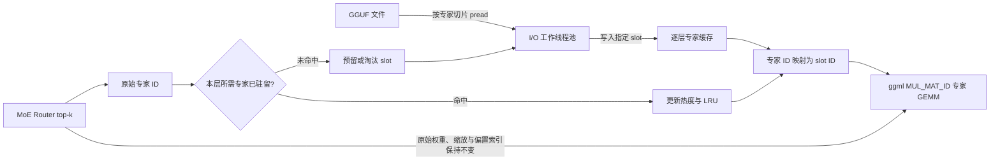

# llama.cpp MoE Streaming Core 项目介绍

> 文档基线：仓库 `main` 分支，提交 `3144261e29a3be416b2a8d7c21e08361bfa595a5`。  
> 整理日期：2026-08-21。本文描述的是当前代码实际行为；后续同步上游后，应重新核对参数、接口和限制。

## 1. 项目概览

本项目是 [ggml-org/llama.cpp](https://github.com/ggml-org/llama.cpp) 的定制分支。它保留 llama.cpp 的 GGUF 模型加载、量化推理、CPU/GPU 混合执行、`llama-cli`、`llama-server` 和 `libllama` 等主体能力，并增加了一套面向超大 Mixture of Experts（MoE）模型的专家权重 SSD 流式加载机制。

核心目标是：当 MoE 模型的全部路由专家权重无法同时装入 RAM 或 VRAM 时，不再完整常驻所有 `ffn_*_exps` 权重，而是只为每个 MoE 层分配固定数量的专家缓存槽位。路由器完成 top-k 专家选择后，运行时从 GGUF 文件按需读取所选专家，将其写入缓存，再把原专家编号映射为缓存槽位编号参与计算。

该机制以更低的常驻内存换取额外的 SSD I/O 和加载等待时间，适用于“模型主要体积来自路由专家，机器具有较快本地 SSD，但内存不足”的场景。

| 项目 | 说明 |
| --- | --- |
| 上游基础 | llama.cpp / ggml |
| 定制能力 | MoE 路由专家权重按需从 GGUF 流式读取 |
| 缓存粒度 | 每层、每个专家切片 |
| 支持的专家权重 | `ffn_gate_exps`、`ffn_up_exps`、`ffn_down_exps`、`ffn_gate_up_exps` 的 `weight` 张量 |
| I/O | 多线程位置读取；兼容时可使用 Linux `O_DIRECT` |
| Prefill | 支持多波次（waved / multi-pass）专家计算 |
| 输出语义 | 不改变路由器选中的专家，只改变专家 ID 到缓存槽位的映射 |
| 许可证 | 沿用仓库根目录的 MIT License |

## 2. 为什么需要专家流式加载

MoE 模型每个 token 通常只激活全部专家中的少数几个。设：

- `E`：每层专家总数，即 `n_expert`；
- `K`：每个 token 激活的专家数，即 `n_expert_used`；
- `S`：每层专家缓存槽位数；
- `T`：当前 ubatch 的 token 数。

标准加载方式仍需把全部 `E` 个专家权重常驻内存，但一次计算只使用其中的 `K` 个。对于专家数量多、专家 FFN 很大的模型，这会形成明显的容量浪费。

本项目利用路由稀疏性，把常驻专家容量从“每层 `E` 个专家”缩小到“每层 `S` 个专家”，其中 `K <= S < E`。未命中的专家在路由完成后才从 GGUF 文件加载。其结果是：

- 路由专家的常驻内存近似按 `S / E` 比例缩小；
- 非专家权重、共享专家、嵌入、注意力权重、KV cache 和运行时激活仍需正常驻留；
- 首次访问或被淘汰后的专家会产生 SSD 读取和同步等待；
- 实际吞吐取决于缓存命中率、SSD 随机读取能力、ubatch 大小和后端上传速度。

因此，这不是把整个模型变成“零内存磁盘推理”，而是针对 MoE 路由专家这一主要容量来源做选择性流式化。

## 3. 与 llama.cpp 原有卸载方式的区别

上游 llama.cpp 已支持量化、CPU/GPU 分层放置、`--cpu-moe`、`--n-cpu-moe` 和多种硬件后端。它们解决的是“权重放在哪个常驻设备上”的问题；本项目解决的是“路由专家是否需要完整常驻”的问题。

| 方式 | 权重是否完整常驻 | 主要作用 |
| --- | --- | --- |
| `-ngl` / `--gpu-layers` | 是 | 在 CPU RAM 与 GPU VRAM 之间分配完整层 |
| `--cpu-moe` | 是 | 强制 MoE 专家权重驻留 CPU RAM |
| 本项目 `--moe-stream` | 否，仅缓存 `S` 个专家/层 | 从 GGUF 按需读取路由专家，降低常驻容量 |

流式专家缓存仍会跟随该层选择的后端缓冲区类型，因此缓存本身可能位于 RAM 或 VRAM。`-ngl` 决定层的设备归属，`--moe-stream-cache` 决定每层缓存多少专家，两者作用不同。

截至本文基线，链接的上游 `master` 中没有本项目的 `src/llama-moe-stream.cpp` 文件，也没有 `moe_stream_slots` 配置符号。本功能应视为该分支的实验性扩展，而不是可直接套用上游预编译包的选项。

## 4. 总体架构



实现由四部分组成：

1. 模型加载器识别可流式化的专家权重，不再物化完整张量，只记录 GGUF 分片编号、文件偏移和单专家字节数。
2. 每个流式 MoE 层创建形状为 `{ne0, ne1, S}` 的缓存张量，替代原来的 `{ne0, ne1, E}` 完整专家张量。
3. 计算图在路由 top-k 后插入 CPU 自定义算子，确保所需专家已驻留，并把专家 ID 改写为缓存 slot ID。
4. 当一次 prefill 触达的不同专家数大于缓存容量时，把专家 GEMM 拆成多个 wave，逐波加载、掩码计算并累加输出。

## 5. 模型加载路径

### 5.1 可流式化张量识别

当前只处理以下路由专家权重张量：

- `LLM_TENSOR_FFN_GATE_EXPS`；
- `LLM_TENSOR_FFN_UP_EXPS`；
- `LLM_TENSOR_FFN_DOWN_EXPS`；
- `LLM_TENSOR_FFN_GATE_UP_EXPS`。

张量还必须满足：

- 属于有效的重复层；
- 后缀为 `weight`；
- 第三维专家数与模型 `n_expert` 一致；
- 张量连续，并能按专家均匀切片；
- 不是 duplicated、skip 或 virtual-skip 张量。

分离的 gate/up/down 会为每层登记 3 个缓存权重；融合 gate_up/down 会登记 2 个。其他模型权重继续沿用 llama.cpp 的正常加载路径。

### 5.2 不物化完整专家张量

加载器使用新增的 `TENSOR_STREAMED` 标记将完整专家张量从实际模型缓冲区中排除，同时保留张量计数和大小核算。运行时为每个可流式层建立较小的缓存张量，并保存：

- GGUF split 文件编号 `file_idx`；
- 完整张量数据起始偏移 `offs`；
- 单个专家切片大小 `nb_expert`。

加载专家 `e` 时，读取偏移为：

```text
expert_offset = tensor_offset + e * bytes_per_expert
```

因此分片 GGUF 文件可以按原始文件索引重新打开并读取，不要求先合并成单文件。

### 5.3 mmap 与文件要求

启用 `--moe-stream` 后，模型加载入口会关闭 mmap。原因是 mmap 预取可能把原本计划流式读取的专家页也拉入系统内存，抵消节省内存的目的。

流式模式要求模型来自可重新打开的实际文件路径。通过匿名流、仅文件描述符或空路径加载的模型会报错。

## 6. 单波次路径：decode 和小规模 prefill

若当前 ubatch 最多触达的不同专家数不超过 `S`，计算图使用单波次路径：

1. Router 按原逻辑生成 top-k 专家 ID 和路由权重。
2. `llama_moe_stream_remap` 收集本层当前 ubatch 的不同专家，保持首次出现顺序。
3. 对已驻留或正在加载的专家记为命中；对未命中专家选择缓存槽并提交 I/O 工作。
4. 自定义算子等待本次所需槽位全部进入 `RESIDENT` 状态。
5. 将每个原专家 ID 替换为对应 slot ID，供专家 `MUL_MAT_ID` 使用。
6. 路由权重、scale、bias 等仍使用原始专家 ID。

该过程只重标记专家索引，不改变 Router 的专家选择和组合顺序。

## 7. 多波次 prefill

### 7.1 为什么需要 wave

一次较大的 prefill ubatch 可能由不同 token 选中大量不同专家。其最坏触达量为：

```text
U_max = min(E, T * K)
```

若 `U_max > S`，单次将所有专家装入缓存不再可行。提交 `13edb29` 引入多波次 prefill，把不同专家按首次出现顺序拆分为多组，每组分别执行专家 GEMM。

### 7.2 wave 容量

缓存需要同时容纳三类槽位：

- 当前 wave 的专家；
- 下一 wave 的预加载专家；
- 每个 token 的 `K` 个 parking slots，用于承接当前 wave 中被掩码的专家对。

因此单 wave 的专家容量为：

```text
C = floor((S - K) / 2)
```

并要求：

```text
C >= K
等价于 S >= 3K
```

图构建阶段按最坏触达量确定 wave 数：

```text
W_max = ceil(U_max / C)
```

计算图的 wave 数按上式固定；实际路由触达的专家较少时，后续 wave 可能为空，但相应图节点仍然存在。统计中的 `waves` 和 `non-empty` 可以帮助判断这部分额外开销。

运行时则根据实际不同专家集合规划各 wave。每个 wave 的执行过程为：

1. 确保本 wave 专家驻留；
2. 尽力预加载下一 wave，使 I/O 与当前专家 GEMM 重叠；
3. 为属于本 wave 的专家对输出真实 slot ID；
4. 为其他专家对分配不重复的 parking slot；
5. 生成 0/1 mask，只保留属于本 wave 的输出；
6. 将所有 wave 的专家输出相加。

计算图通过前一 wave 输出的一个单元素 view 建立顺序依赖，确保缓存槽在前一 wave 的 GEMM 消费完成后才可被下一 wave 重写。

### 7.3 结果一致性

wave 机制不修改原始专家选择。每个被选中的专家在其所属 wave 中计算一次，其他 wave 的对应位置被 mask 为 0，最终再求和。

设计目标是与非流式路径保持相同结果。在使用相同内核和权重布局时（代码中特别指出 CUDA 路径）可做到 bit-exact；CPU 非流式路径若对权重进行了额外 repack，末位浮点结果可能有轻微差异。因此验证时应同时比较 token 输出和数值容差，而不应在所有后端上无条件要求逐字节一致。

## 8. 缓存与淘汰策略

每个流式层独立维护 `S` 个槽位。槽位状态为：

| 状态 | 含义 |
| --- | --- |
| `EMPTY` | 未分配 |
| `LOADING` | 已为某专家预留，任务已入队或正在读取 |
| `RESIDENT` | 专家权重已完整写入缓存 |

淘汰优先级如下：

1. 优先使用空槽；
2. 不淘汰当前调用必须保留的 `keep` 槽；
3. 不淘汰仍在 `LOADING` 的槽；
4. 在可淘汰驻留槽中，优先淘汰路由热度最低的专家；
5. 热度相同时，以最久未使用的槽作为 LRU 决胜条件。

路由热度使用饱和计数器。大约每 64 个 token 对应的全层 remap 周期后，所有流式层的热度计数右移一位，使早期热门但近期冷却的专家可以逐渐被淘汰。

每次重新预留槽位都会增加 generation。工作线程提交结果前检查 generation、专家 ID 和槽状态，从而丢弃已过期或重复的加载任务。

## 9. I/O 实现

### 9.1 工作线程池

I/O 线程在第一次 remap 时延迟创建：

- 默认线程数：9；
- 最大线程数：18；
- `N <= 0` 使用默认值；
- `N > 18` 会被截断为 18。

每个线程分配一个 4096 字节对齐的 staging buffer。线程按位置读取专家切片，再使用 `ggml_backend_tensor_set` 写入目标缓存槽，因此缓存可位于 CPU 或设备后端。

### 9.2 buffered read 与 O_DIRECT

默认使用带系统页缓存的位置读取。启用 `--moe-stream-direct` 后，兼容平台会尝试以 `O_DIRECT` 重新打开 GGUF 文件：

- offset、读取长度和 staging buffer 按 4096 字节对齐；
- 允许为头尾对齐多读少量数据；
- 打开后会执行一次探测读取；
- 操作系统或文件系统不支持时，自动回退到 buffered read 并输出警告。

`O_DIRECT` 的主要价值是避免超大模型专家页污染系统 page cache，不保证在所有 SSD、文件系统或负载下更快。网络文件系统、overlay filesystem、macOS 和 Windows 等环境可能回退。

Windows 路径没有并发位置读取原语，当前实现用全局互斥锁串行化 `seek + read`。因此 Windows 上提高 I/O 线程数未必能带来与 Linux 相同的读取并行度。

## 10. 命令行参数

这些参数进入 llama.cpp 的公共参数系统，可用于采用该系统的工具，例如 `llama-cli` 和 `llama-server`。

| 参数 | 含义 | 默认/规则 |
| --- | --- | --- |
| `--moe-stream` | 开启 MoE 路由专家流式加载 | 默认关闭 |
| `--moe-stream-cache <NG\|Ns>` | 设置总缓存预算或每层槽数 | 裸整数、`G`、`GB`、`GiB` 表示整数 GiB；`s`、`slot`、`slots` 表示槽数；该参数会自动开启流式模式 |
| `--moe-stream-io-threads N` | 设置专家加载线程数 | 默认 9，最大 18；自动开启流式模式 |
| `--moe-stream-direct` | 尝试 `O_DIRECT`，绕过 page cache | 不可用时回退；自动开启流式模式 |

对应环境变量为：

| 环境变量 | 对应参数 |
| --- | --- |
| `LLAMA_ARG_MOE_STREAM` | `--moe-stream` |
| `LLAMA_ARG_MOE_STREAM_CACHE` | `--moe-stream-cache` |
| `LLAMA_ARG_MOE_STREAM_IO_THREADS` | `--moe-stream-io-threads` |
| `LLAMA_ARG_MOE_STREAM_DIRECT` | `--moe-stream-direct` |

内部诊断开关：

| 环境变量 | 作用 |
| --- | --- |
| `LLAMA_MOE_STREAM_DEBUG` | 输出专家淘汰 debug 日志 |
| `LLAMA_MOE_STREAM_NO_PRELOAD` | 禁用下一 wave 的尽力预加载，用于对比和排障 |

两个内部开关都按“环境变量是否存在”判断，因此即使值写成 `0` 也会启用对应行为；恢复默认行为应取消设置变量。

## 11. 缓存大小计算

### 11.1 自动模式

仅指定 `--moe-stream` 时：

```text
S = clamp(2 * K, 16, E)
```

如果最终 `S >= E`，代码会认为缓存已经覆盖全部专家，关闭流式模式并正常加载完整权重。

自动值适合 decode 或专家触达较少的 ubatch，但不一定满足大规模 waved prefill 的 `S >= 3K` 要求。若模型 `K` 较大或使用大 `-ub`，应显式增加槽数。

### 11.2 按槽数配置

例如每层缓存 64 个专家：

```text
--moe-stream-cache 64s
```

近似缓存大小为：

```text
cache_bytes ~= S * sum(bytes_per_expert_of_each_streamed_weight_in_each_layer)
```

实际后端缓冲区还可能包含对齐开销。

### 11.3 按总 GiB 预算配置

例如总专家缓存预算为 40 GiB：

```text
--moe-stream-cache 40
--moe-stream-cache 40GiB
```

解析器当前只接受整数。代码统计所有可流式层中“一个专家跨 gate/up/down 权重的总字节数”，再用预算除以该值推导统一的每层槽位数：

```text
S = max(floor(total_budget / one_slot_across_all_layers), K)
```

若推导结果覆盖全部 `E` 个专家，流式模式会被关闭。

## 12. 构建与运行

本功能直接编译进 `llama` 核心库，无独立构建开关。构建方式与当前仓库的 llama.cpp 保持一致。

### 12.1 CPU 构建

```bash
cmake -B build
cmake --build build --config Release -j 8
```

### 12.2 CUDA 构建

```bash
cmake -B build -DGGML_CUDA=ON
cmake --build build --config Release -j 8
```

其他后端请参考本仓库的 [构建文档](build.md)。多配置生成器（例如 Visual Studio）通常会把程序放在 `build/bin/Release/`，单配置生成器通常位于 `build/bin/`。

### 12.3 最小运行示例

使用自动缓存：

```bash
./build/bin/llama-cli \
  -m /path/to/moe-model.gguf \
  --moe-stream \
  -p "Explain sparse Mixture of Experts." \
  -n 128
```

按每层槽数配置：

```bash
./build/bin/llama-cli \
  -m /path/to/moe-model.gguf \
  --moe-stream-cache 64s \
  --moe-stream-io-threads 9 \
  -ub 128 \
  -n 128
```

使用总预算并尝试绕过 page cache：

```bash
./build/bin/llama-cli \
  -m /path/to/moe-model.gguf \
  --moe-stream-cache 40GiB \
  --moe-stream-io-threads 12 \
  --moe-stream-direct \
  -n 128
```

启动 OpenAI 兼容服务：

```bash
./build/bin/llama-server \
  -m /path/to/moe-model.gguf \
  --moe-stream-cache 64s \
  --moe-stream-io-threads 9 \
  --port 8080
```

命令中的 `64s`、`40GiB`、线程数和 `-ub` 都只是示例，必须根据模型的 `E`、`K`、单专家大小、设备缓存容量和 SSD 性能调整。

## 13. 调优建议

建议按以下顺序调整：

1. 先确认模型确实是 MoE，启动日志中应出现 `MoE expert SSD streaming enabled`。
2. 从 `S >= 3K` 的明确槽数开始，避免大 prefill 触发 wave 容量错误。
3. 观察最终统计中的 hit rate、cold misses、load stall 和 wave stall。
4. 命中率低且设备内存仍有余量时，增大 `--moe-stream-cache`。
5. prefill 频繁进入大量 wave 时，可同时增大缓存或减小 `-ub`。
6. SSD 队列深度不足时逐步增加 I/O 线程；超过设备能力后，更多线程只会增加争用。
7. 模型远大于 RAM 且运行于兼容 Linux 本地文件系统时，对比 buffered read 与 `--moe-stream-direct`。
8. 保持 GGUF 位于低延迟 NVMe SSD；机械硬盘、网络盘或拥塞的共享盘通常会造成明显 stall。

需要注意，增大 `-ub` 有利于常规计算吞吐，却可能让更多不同专家同时被触达，导致更多 wave 和 I/O。该参数应与缓存槽数联合调优。

## 14. 运行统计

`llama_perf_context_print`、公共采样性能输出以及公开 API `llama_moe_stream_print_stats(model)` 会打印流式统计。

主要指标：

| 指标 | 含义 |
| --- | --- |
| `remap calls` | 专家 ID 映射调用次数 |
| `expert hits` | 所需专家已驻留或已在加载的次数 |
| `misses` | 发起的按需加载次数 |
| `cold` | 运行期间第一次访问该专家造成的 miss |
| `hit rate` | `hits / (hits + misses)` |
| `load stall` | 单波次 remap 等待专家加载的总时间和平均时间 |
| `waves` | wave 自定义算子调用数及非空 wave 数 |
| `preloads issued` | 为下一 wave 发出的预加载数 |
| `ready on arrival` | 下一 wave 开始时已由预加载准备完成的专家数 |
| `wave stall` | 多波次路径等待专家加载的累计时间 |

示例日志结构：

```text
llama_moe_stream_print_stats: moe stream: remap calls = ..., expert hits = ..., misses = ... (... cold), hit rate = ...%
llama_moe_stream_print_stats: moe stream: load stall = ... ms total (... ms per remap call)
llama_moe_stream_print_stats: moe stream: waves = ... (... non-empty), preloads issued = ... (ready on arrival = ...), wave stall = ... ms
```

## 15. 兼容性与已知限制

1. **仅适用于 MoE 路由专家权重。** 非 MoE 模型会输出警告并禁用流式模式；未找到可流式张量时也会自动禁用。
2. **不是所有模型体积都能被流式化。** 共享专家、Router、attention、embedding、输出层、KV cache 和激活内存不在该机制范围内。
3. **同一流式模型不支持多个 context 并发 decode。** 一个 context 可能淘汰另一个 context 的在途计算图仍在引用的槽位。
4. **专家权重 LoRA 不受支持。** LoRA 若目标名称包含 `_exps.`，加载时会明确报错；非专家目标仍走原路径。
5. **tensor buffer override 不应用于流式专家。** `-ot`、`--cpu-moe` 等覆盖项不会改变这些缓存张量的选择逻辑，并会输出警告。
6. **warmup 会被跳过。** llama.cpp 的 warmup 图可能让每个 token 同时路由到全部专家，超出流式缓存能力。
7. **host cache 下会关闭 op offload。** op offload 会假设图执行期间 host 权重不变，而 wave 会重写缓存。
8. **大 prefill 需要足够槽位。** 进入多波次路径时要求 `S >= 3K`，否则会中止并提示增大缓存或减小 `-ub`。
9. **读取错误为致命错误。** 专家文件读取失败会设置全局失败状态，随后中止推理，不会自动重试或降级为完整加载。
10. **`O_DIRECT` 具有平台限制。** 不支持时自动回退；不能把出现 `--moe-stream-direct` 等同于实际启用了 direct I/O，应检查启动日志。
11. **API/ABI 与上游不同。** `llama_model_params` 新增字段，使用 `libllama` 的下游程序应与本分支头文件和库一起重新编译。
12. **当前没有专用回归测试。** 仓库中未发现以 `moe-stream` 命名的测试或基准，生产使用前应对目标模型、后端和文件系统做验证。

## 16. 常见错误与排查

### `requires a MoE model -- disabled`

模型元数据中没有有效的 `n_expert` 或 `n_expert_used`。确认使用的是包含路由专家的 GGUF。

### `cache ... covers all ... experts -- streaming disabled`

缓存槽数不小于专家总数，已没有流式化收益。减小 `--moe-stream-cache`，或接受正常完整加载。

### `no streamable expert tensors found`

模型虽为 MoE，但张量命名、形状或模型实现没有进入当前支持的 `ffn_*_exps.weight` 路径。打开 debug 日志并核对 GGUF 张量信息。

### `needs ... distinct experts but the cache has only ... slots`

单波次实际触达专家数超过槽位。当前代码通常会在可预测的大 prefill 中构建 wave；若仍遇到该错误，应增大槽数或减小 `-ub`。

### `multi-pass expert GEMMs need ... 3*n_expert_used slots`

当前 `S < 3K`，无法同时容纳当前 wave、下一 wave 预加载和 parking slots。设置至少 `3K` 个槽，或减少导致大量专家触达的 ubatch。

### `expert load failed (I/O error)`

检查 GGUF 分片是否完整、文件是否在运行期间被移动、权限是否正确、底层磁盘是否健康，以及 direct I/O 回退日志。

### 命中率高但仍然很慢

除专家读取外，缓存写入设备、后端同步、非专家层计算和 KV cache 都可能成为瓶颈。分别比较：

- 非流式基线；
- buffered stream；
- direct stream；
- 不同 I/O 线程数；
- 不同 `S` 和 `-ub`。

## 17. C/C++ API 扩展

`llama_model_params` 新增：

```cpp
uint32_t moe_stream_slots;
uint64_t moe_stream_budget;
int32_t  moe_stream_io_threads;
bool     moe_stream_direct;
bool     moe_stream;
```

统计接口：

```cpp
void llama_moe_stream_print_stats(const struct llama_model * model);
```

未启用流式模式时该接口为空操作。直接使用 C API 的程序应从 `llama_model_default_params()` 获取默认参数，再覆盖所需字段，避免遗漏未来新增字段。

## 18. 代码导航

| 文件 | 作用 |
| --- | --- |
| [`src/llama-moe-stream.h`](../src/llama-moe-stream.h) | 流式管理器、逐层状态、槽位状态、工作项、wave 计划和统计定义 |
| [`src/llama-moe-stream.cpp`](../src/llama-moe-stream.cpp) | 文件读取、线程池、缓存替换、ID remap、多波次规划、预加载和统计实现 |
| [`src/llama-model.cpp`](../src/llama-model.cpp) | 计算槽位数、识别流式张量、创建缓存张量和打开 GGUF 文件 |
| [`src/llama-model-loader.cpp`](../src/llama-model-loader.cpp) | `TENSOR_STREAMED` 跳过完整权重物化 |
| [`src/llama-graph.cpp`](../src/llama-graph.cpp) | 在 MoE 图中插入 remap；构建 waved GEMM、mask 和输出累加 |
| [`src/llama-context.cpp`](../src/llama-context.cpp) | context 兼容处理、图节点容量和性能统计 |
| [`src/llama.cpp`](../src/llama.cpp) | 流式模式下关闭 mmap |
| [`src/llama-adapter.cpp`](../src/llama-adapter.cpp) | 拒绝针对流式专家权重的 LoRA |
| [`common/arg.cpp`](../common/arg.cpp) | 命令行参数与环境变量 |
| [`common/common.cpp`](../common/common.cpp) | 公共参数传递和 warmup 处理 |
| [`include/llama.h`](../include/llama.h) | 对外模型参数和统计 API |
| [`src/CMakeLists.txt`](../src/CMakeLists.txt) | 将流式实现编译进核心库 |

## 19. 提交历史解读

当前本地 Git 历史只保留 3 个线性提交，总体上是“上游快照 + 两阶段功能开发 + 再次同步上游”：

| 提交 | 日期 | 内容 |
| --- | --- | --- |
| `bc8b9ef` | 2026-07-03 | 初始仓库快照，并加入 MoE 专家 SSD streaming 核心、异步 I/O 线程池和 `O_DIRECT` 支持 |
| `13edb29` | 2026-07-04 | 增加 waved prefill；修改 `src/llama-context.cpp`、`src/llama-graph.cpp`，扩展 `src/llama-moe-stream.{h,cpp}` |
| `3144261` | 2026-07-05 | 提交信息标记为同步 `upstream/master`，并保留流式能力 |

需要特别说明：`bc8b9ef` 是根提交，包含完整 llama.cpp 源码快照；`3144261` 在当前仓库图中也只有一个父提交。也就是说，本地历史没有保留一个可用于精确 `git diff upstream...feature` 的完整上游父链。因此本文对“本项目改动”的归纳以专用文件、`moe_stream` 符号、集成点和提交说明为依据，而不是把根提交中的所有文件都视为定制代码。

## 20. 建议的验证流程

在目标机器上至少完成以下验证：

1. **加载验证**：确认启动日志显示流式模式、实际槽数、I/O 线程数和专家缓存 MiB。
2. **容量验证**：确认进程 RAM/VRAM 峰值符合预期，并包含非专家权重、KV cache 和运行时开销余量。
3. **一致性验证**：在能完整加载的小模型或较小量化版本上，以相同 prompt、seed 和采样参数比较流式与非流式结果。
4. **prefill 验证**：分别测试短 prompt 和长 prompt，确保单波次与多波次路径均被覆盖。
5. **I/O 验证**：比较 buffered 与 direct 模式，检查 direct 是否真正启用而非回退。
6. **性能验证**：记录 prompt tokens/s、generation tokens/s、命中率、load stall、wave stall 和磁盘吞吐。
7. **稳定性验证**：测试 GGUF 多分片、长时间生成、server 请求和模型释放，确认线程能正常退出。

推荐保存下列实验矩阵，而不是只记录单次 tokens/s：

| 变量 | 建议取值 |
| --- | --- |
| 缓存槽 `S` | `3K`、`4K`、更大的可用容量 |
| ubatch | 32、64、128、256，按模型与设备调整 |
| I/O 线程 | 1、4、9、12、18 |
| I/O 模式 | buffered、direct（若实际启用） |
| prompt | 短 decode 型、长 prefill 型 |

## 21. 与上游同步时的注意事项

该功能横跨模型参数、loader、模型张量创建、MoE 计算图、context 图容量和公共参数系统。同步新版 llama.cpp 时，建议重点检查：

1. `llama_model_params` 字段布局和默认初始化；
2. `llm_tensor` 中专家权重枚举及新 MoE 架构的张量命名；
3. `build_moe_ffn` 的参数、top-k 路径和 `MUL_MAT_ID` 调用方式；
4. 后端 buffer 是否支持 slot 级 `ggml_backend_tensor_set`；
5. GGUF loader 对 skip、virtual tensor、split 文件和 offset 的处理；
6. graph scheduler 对 custom op、跨后端依赖和可变 host buffer 的假设；
7. 上游新增的 MoE 专用 CUDA/SYCL/Metal kernel 是否仍接受 remap 后的 slot ID；
8. CLI 参数命名是否与上游新增选项冲突；
9. warmup、op offload、LoRA 和多 context 并发语义是否变化；
10. 上游是否已出现同类能力，避免维护两套不兼容实现。

## 22. 参考资料

- [llama.cpp 上游仓库](https://github.com/ggml-org/llama.cpp)
- [llama.cpp 构建文档](https://github.com/ggml-org/llama.cpp/blob/master/docs/build.md)
- [llama.cpp CLI 文档](https://github.com/ggml-org/llama.cpp/tree/master/tools/cli)
- [llama.cpp Server 文档](https://github.com/ggml-org/llama.cpp/tree/master/tools/server)
- [ggml 项目](https://github.com/ggml-org/ggml)
- 本仓库根目录 [`README.md`](../README.md)
- 本仓库 [`LICENSE`](../LICENSE)
